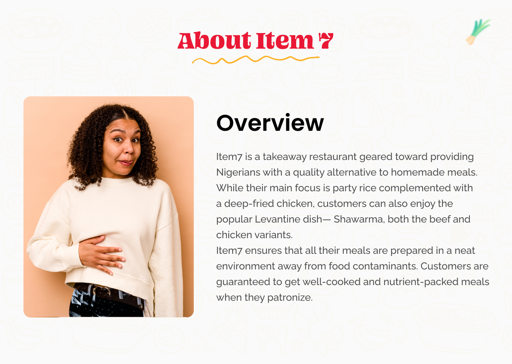
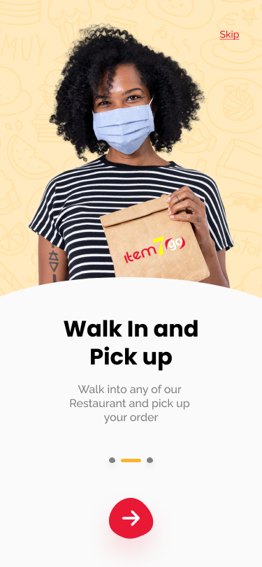
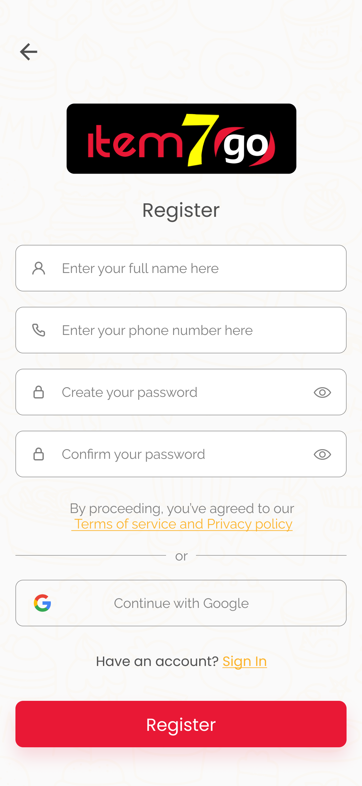
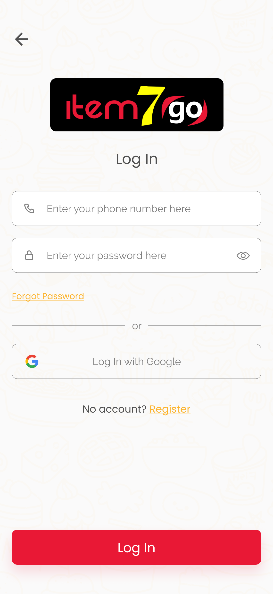
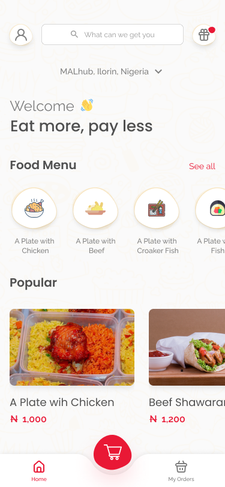
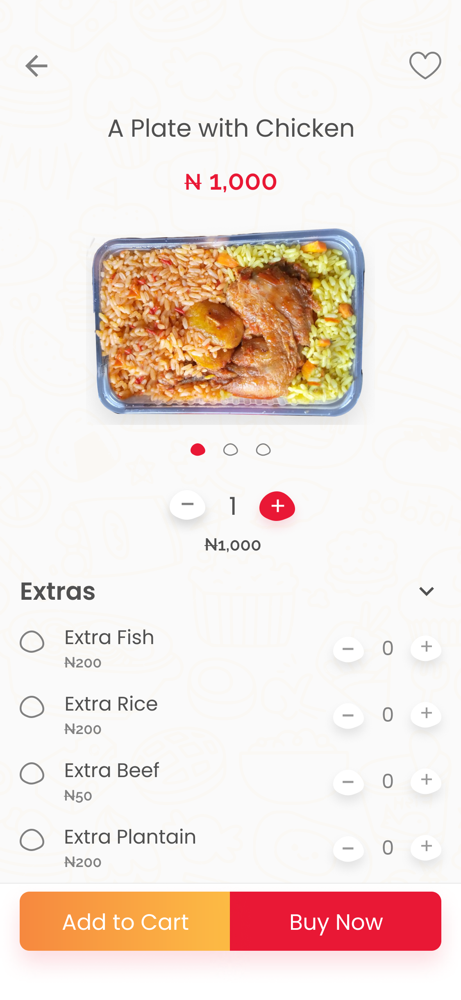
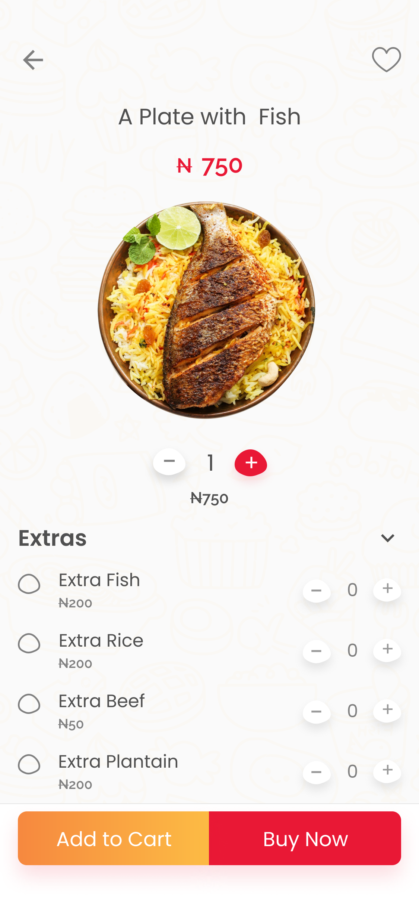
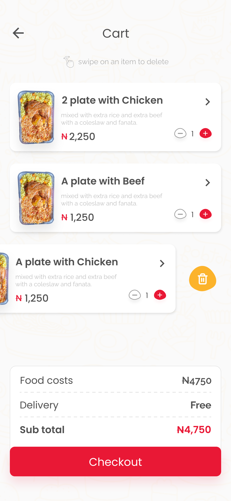
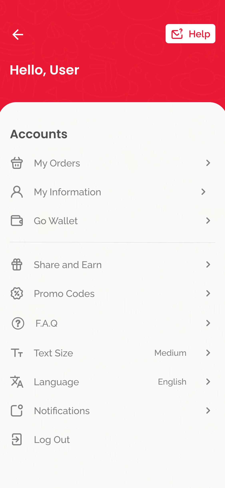
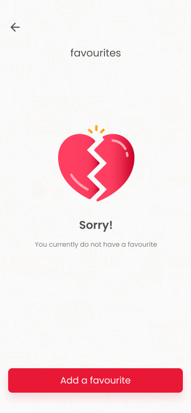

# Item 7 Food Order App

Item 7 Mobile App Created with React Native

# About Item 7

# Onborading pages

# Signup and Login Page

# Home Page

# Order Page

# Cart Page

# Profile Page

# Favorites Page

# Components and Icons

